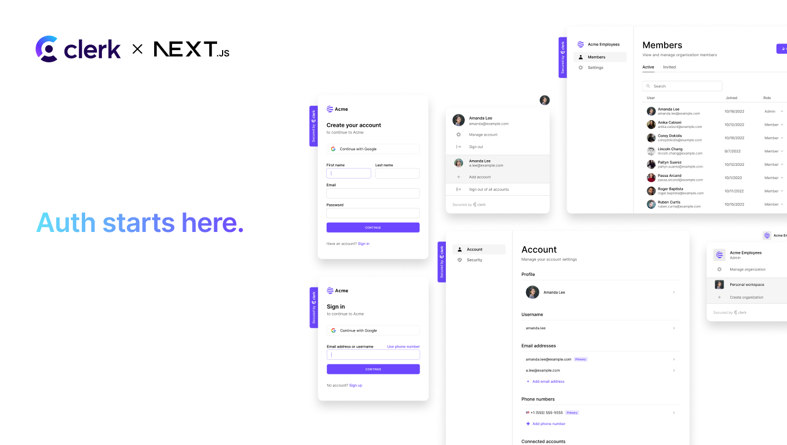

<p align="center">
  <a href="https://go.clerk.com/e3UDpP4" target="_blank" rel="noopener noreferrer">
   <picture>
      <source media="(prefers-color-scheme: dark)" srcset="./public/light-logo.png">
      
    </picture>
  </a>
  <br />
</p>
<div align="center">
  <h1>
    Next.js Clerk auth starter template
  </h1>
  <a href="https://www.npmjs.com/package/@clerk/clerk-js">
    
  </a>
  <a href="https://discord.com/invite/b5rXHjAg7A">
    
  </a>
  <a href="https://twitter.com/clerkdev">
    
  </a>
  <br />
  <br />
  
</div>

## Introduction

Clerk is a developer-first authentication and user management solution. It provides pre-built React components and hooks for sign-in, sign-up, user profile, and organization management. Clerk is designed to be easy to use and customize, and can be dropped into any React or Next.js application.

This template allows you to get started with Clerk and Next.js (App Router) in a matter of minutes, and demonstrates features of Clerk such as:

- Fully functional auth flow with sign-in, sign-up, and a protected page
- Customized Clerk components with Tailwind CSS
- Hooks for accessing user data and authentication state
- Organizations for multi-tenant applications

## Demo

A hosted demo of this example is available at https://clerk-nextjs-app-router.vercel.app/

## Deploy

Easily deploy the template to Vercel with the button below. You will need to set the required environment variables in the Vercel dashboard.

[](https://vercel.com/new/clone?repository-url=https%3A%2F%2Fgithub.com%2Fclerk%2Fnextjs-auth-starter-template&project-name=nextjs-clerk&repository-name=nextjs-with-clerk&demo-title=Next.js+Clerk+Template&demo-description=A+Next.js+application+pre-configured+to+authenticate+users+with+Clerk.&demo-url=https%3A%2F%2Fnextjs-auth-starter-template-kit.vercel.app%2F&demo-image=%2F%2Fraw.githubusercontent.com%2Fclerk%2Fnextjs-auth-starter-template%2Frefs%2Fheads%2Fmain%2Fpublic%2Fog.png&products=%5B%7B%22type%22%3A%22integration%22%2C%22integrationSlug%22%3A%22clerk%22%2C%22productSlug%22%3A%22clerk%22%2C%22protocol%22%3A%22authentication%22%2C%22group%22%3A%22%22%7D%5D)

## Running the template

```bash
git clone https://github.com/clerk/clerk-nextjs-demo-app-router
```

To run the example locally, you need to:

1. Sign up for a Clerk account at [https://clerk.com](https://go.clerk.com/31bREJU).
2. Go to the [Clerk dashboard](https://go.clerk.com/4I5LXFj) and create an application.
3. Set the required Clerk environment variables as shown in [the example `env` file](./.env.example).
4. Go to "Organization Settings" in your sidebar and enable Organizations
5. `npm install` the required dependencies.
6. `npm run dev` to launch the development server.

## Learn more

To learn more about Clerk and Next.js, check out the following resources:

- [Quickstart: Get started with Next.js and Clerk](https://go.clerk.com/vgWhQ7B)
- [Clerk Documentation](https://go.clerk.com/aNiTioa)
- [Next.js Documentation](https://nextjs.org/docs)

## Found an issue or have feedback?

If you have found an issue with this repo or have feedback, please join our Discord and create a new thread inside of our [support](https://clerk.com/discord) channel.

If it's a quick fix, such as a misspelled word or a broken link, feel free to skip creating a thread.
Go ahead and create a [pull request](https://github.com/clerk/clerk-nextjs-demo-app-router/pulls) with the solution. :rocket:

## Connect with us

You can discuss ideas, ask questions, and meet others from the community in our [Discord](https://clerk.com/discord).

If you prefer, you can also find support through our [Twitter](https://twitter.com/ClerkDev), or you can [email](mailto:support@clerk.dev) us!
